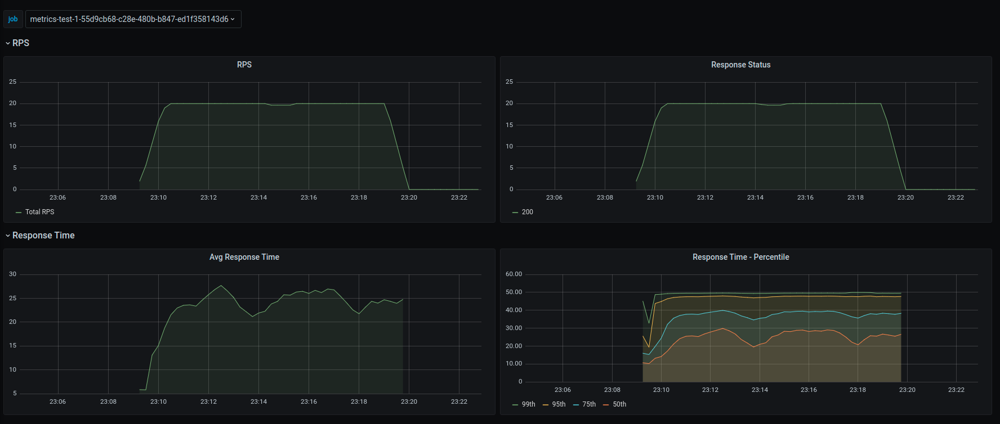

[![Docker hub][dockerhub-badge]][dockerhub-url]
[![MIT licensed][mit-badge]][mit-url]
[![Github][github-badge]][github-rep]

[dockerhub-badge]: https://github.com/eipi1/overload/actions/workflows/dockerhub-push.yml/badge.svg

[dockerhub-url]: https://hub.docker.com/r/mdsarowar/overload

[mit-badge]: https://img.shields.io/badge/license-MIT-blue.svg

[mit-url]: https://github.com/tokio-rs/tokio/blob/master/LICENSE

[github-badge]: https://img.shields.io/badge/github-eipi1/overload-brightgreen

[github-rep]: https://github.com/eipi1/overload

# Overload

A distributed load testing utility written in Rust


* [Usage](#usage)
* [Environment variables](#environment-variables)
* [APIs](#apis)
* [Monitoring](#monitoring)

## Usage

Overload support two modes - cluster & standalone. Overload exposes a set of [APIs](#apis)
at port `3030` to manage tests.

### Cluster

Cluster mode allows the application run in primary/secondary mode, but all the complexity should be transparent to the
users. Currently, only supported on Kubernetes.

There are a few constraints/limitations is in place -

* Shared storage between all nodes for tests using csv to work properly
* Minimum required node: 3
* Maximum nodes: 20
* Requires container image tagged as *{version}-cluster*

Repository provides a sample *[deployment.yaml][deployment-yaml]* file. Addition to that the
application also needs "get", "list" permission for "pods", "endpoints" for discovery. 

### Standalone

Runs the application in simple single instance mode. Requires container images tagged as *{version}-standalone.

For example to run the latest snapshot

```shell
docker run -p 3030:3030 mdsarowar/overload:latest-standalone-snapshot
```

## Environment variables

| variable           | desc                                                                            | default  |
|--------------------|---------------------------------------------------------------------------------|----------|
| LOG_LEVEL          | application log level                                                           | info     |
| DATA_DIR           | path to store uploaded CSV, should be shared among all instance in cluster mode | /tmp     |
| K8S_ENDPOINT_NAME  | name of the [endpoints][endpoint-api] (cluster mode only)                       | overload |
| K8S_NAMESPACE_NAME | kubernetes namespace                                                            | default  |

## APIs

### Request
Test specification

| Field    | Required | Default | Description                                                         | Data type                           |
|----------|----------|---------|---------------------------------------------------------------------|-------------------------------------|
| name     | ❎        | UUID    | Test name, application will append UUID to ensure unique identifier | String                              |
| duration | ✅        |         | Test duration                                                       | uint32                              |
| req      | ✅        |         | Request provider Spec                                               | [RequestProvider](#requestprovider) |
| qps      | ✅        |         | RPS specification                                                   | [QPSSpec](#qpsspec)                 |

```http request
POST /test HTTP/1.1
Host: localhost:3030
Content-Type: application/json

{
  "duration": 120,
  "name": "demo-test",
  "qps": {
    "ConstantQPS": {
      "qps": 1
    }
  },
  "req": {
    "RequestList": {
      "data": [
        {
          "body": null,
          "method": "GET",
          "url": "http://httpbin.org/"
        }
      ]
    }
  },
  "histogramBuckets": [35,40,45,48,50, 52]
}
```

This will run the test for 120 seconds with a linear increase in request per seconds(RPS).

### Response

| field  | Description        | data type               |
|--------|--------------------|-------------------------|
| job_id | Test ID            | UUID                    |
| status | status of the test | [JobStatus](#jobstatus) |

```json
{
  "job_id": "1b826ded-34d5-434c-b983-a1ba46ffff82",
  "status": "Starting"
}
```

### RequestProvider

Currently, supports the following providers

#### RequestList

An unordered set of [HttpReq](#httpreq)

| field | Description      | data type             |
|-------|------------------|-----------------------|
| data  | Array of HttpReq | [[HttpReq](#httpreq)] |

#### RequestFile

Get request data from a file. File have to be [uploaded](#upload-request-data-file) before the test.

| field     | Description             | data type |
|-----------|-------------------------|-----------|
| file_name | ID of the uploaded file | UUID      |

##### Example

<details>
  <summary>Example Request</summary>

```json
{
  "duration": 3,
  "req": {
    "RequestFile": {
      "file_name": "4e1d1b32-0f1e-4b31-92dd-66f51c5acf9a"
    }
  },
  "qps": {
    "ConstantQPS": {
      "qps": 8
    }
  }
}
```

</details>

#### RandomDataRequest

Generate request with random data based on constraints, can be specified using JSON Schema like syntax.

| field          | Required | Description                                                                                                                                       | data type           |
|----------------|----------|---------------------------------------------------------------------------------------------------------------------------------------------------|---------------------|
| method         | Yes      | HTTP method                                                                                                                                       | Enum ("POST","GET") |
| url            | Yes      | Request Url, optionally supports param substitution. Param name should be of format `{[a-z0-9]+}`, e.g. http://httpbin.org/anything/{param1}/{p2} | string              |
| headers        | No       | HTTP request header                                                                                                                               | Map<String,String>  |
| bodySchema     | No       | Request body spec to be used for random data generation                                                                                           | JSON Schema         |
| uriParamSchema | No       | Url param spec to be used for random data generation                                                                                              | JSON Schema         |

#### Supported JSON Schema spec

| type    | supported |
|---------|-----------|
| string  | ✅         |
| integer | ✅         |
| object  | ✅         |
| array   | ❎         |
| boolean | ❎         |
| null    | ❎         |

| Constraints | Supported | Note                                                                                                                                                       | 
|-------------|-----------|------------------------------------------------------------------------------------------------------------------------------------------------------------|
| minLength   | ✅         |                                                                                                                                                            |
| maxLength   | ✅         |                                                                                                                                                            |
| minimum     | ✅         |                                                                                                                                                            |
| maximum     | ✅         |                                                                                                                                                            |
| constant    | ✅         |                                                                                                                                                            |
| pattern     | ✅         | Unicode pattern. Careful with character groups, e.g. `\d` represents digits from english, arabic and other languages. Maximum repeat(`*`,`+`) length is 10 |
| format      | ❎         |                                                                                                                                                            |

<details>
<summary> Example </summary>

```json
{
  "duration": 10,
  "req": {
    "RandomDataRequest": {
      "url": "http://httpbin.org/anything/{param1}/{param2}",
      "method": "GET",
      "bodySchema": {
        "title": "Person",
        "type": "object",
        "properties": {
          "firstName": {
            "type": "string",
            "description": "The person's first name."
          },
          "lastName": {
            "type": "string",
            "description": "The person's last name."
          },
          "age": {
            "description": "Age in years which must be equal to or greater than zero.",
            "type": "integer",
            "minimum": 1,
            "maximum": 100
          }
        }
      },
      "uriParamSchema": {
        "type": "object",
        "properties": {
          "param1": {
            "type": "string",
            "description": "The person's first name.",
            "minLength": 6,
            "maxLength": 15
          },
          "param2": {
            "description": "Age in years which must be equal to or greater than zero.",
            "type": "integer",
            "minimum": 1000000,
            "maximum": 1100000
          }
        }
      }
    }
  },
  "qps": {
    "ConstantQPS": {
      "qps": 5
    }
  }
}
```

</details>

#### HttpReq

| field   | Description         | data type          |
|---------|---------------------|--------------------|
| method  | HTTP method         | Enum(POST,GET)     |
| url     | valid url           | string             |
| body    | Body for POST       | string             |
| headers | HTTP request header | Map<String,String> |

### QPSSpec

Currently, supports the following specifications

#### ConstantQPS

| field | Description                        | data type |
|-------|------------------------------------|-----------|
| qps   | QPS to maintain for the `duration` | uint32    |

#### Linear

Increase QPS linearly; QPS for any time is calculated using eq. qps = ax + b, where x being the n-th second.

| field | Description       | data type |
|-------|-------------------|-----------|
| a     | Slope of the line | float     |
| b     | Intercept         | uint32    |
| max   | max QPS           | uint32    |

##### Example

```json
{
  "qps": {
    "Linear": {
      "a": 2,
      "b": 1,
      "max": 12
    }
  }
}
```

If a test runs for 10 seconds, the generated RPS will be [1, 5, 7, 9, 11, 12, 12, 12, 12, 12]

#### ArrayQPS

Specify RPS directly

| field | Description  | data type |
|-------|--------------|-----------|
| qps   | Array of qps | [uint32]  |

##### Example

```json
{
  "qps": {
    "ArrayQPS": {
      "qps": [1, 4, 6, 10, 20, 10]
    }
  }
}
```

If a test runs for 10 seconds, generated RPS will be 1 on the first second, 4 on second, 6 on third seconds and
10, 20, 10 on 4, 5, 6th second. It'll restart from 0 position once reaches the end of the array, so on the 7th seconds,
QPS will go down back to 1 and 4, 6, 10 on 8, 9, 10th seconds, respectively.

### Upload Request Data File

Currently, supports CSV file only.

```
POST /test/requests-bin HTTP/1.1
Host: overload.host:3030
Content-Type: text/csv
Content-Length: 22

"<file contents here>"
```

Curl sample

```shell
curl --location --request POST 'overload.host:3030/test/requests-bin' \
--header 'Content-Type: text/csv' \
--data-binary '@/path/to/requests.csv'
```

#### CSV format

```
"url","method","body","headers"
"http://httpbin.org/anything/11","GET","","{}"
"http://httpbin.org/anything/13","GET","","{}"
"http://httpbin.org/anything","POST","{\"some\":\"random data\",\"second-key\":\"more data\"}","{\"Authorization\":\"Bearer 123\"}"
"http://httpbin.org/bearer","GET","","{\"Authorization\":\"Bearer 123\"}"
```

#### Response

API returns valid count, i.e. count of requests that has been parsed successfully and a file ID. File ID will be
required to for testing.

| field       | Description                      | data type |
|-------------|----------------------------------|-----------|
| valid_count | number of valid requests in file | uint32    |
| file        | ID of the file                   | UUID      |

### JobStatus

Enum stating the current status of the test

| value            | Description                                            |
|------------------|--------------------------------------------------------|
| Starting         | Job starting or submitted to the queue                 |
| InProgress       | Job is running                                         |
| Stopped          | Job stopped by User                                    |
| Completed        | Job Done                                               |
| Failed           | Some error happened, Couldn't finish executing the job |
| Error(ErrorCode) | Other error                                            |

### Get Job Status

Returns status of all jobs.

**Limitation -**

* Keep status only for 10 minutes, will be cleaned up after that
* No way to get status by job id
* Doesn't maintain any kind of sorting

#### Request

| Spec   | Value        |
|--------|--------------|
| Path   | /test/status |
| Method | GET          |

#### Query Params

| field  | Description       | data type |
|--------|-------------------|-----------|
| offset | start of the page | uint32    |
| limit  | size of the page  | uint32    |

#### Response

| field    | Description                                          | data type               |
|----------|------------------------------------------------------|-------------------------|
| {job_id} | Test job identifier received when test was submitted | string                  |
| {status} | current status of the test job                       | [JobStatus](#jobstatus) |

#### Example

```http request
GET /test/status?offset=1&limit =1 HTTP/1.1
Host: localhost:3030
```

```json
{
  "60de342e-b18c-4837-80d2-a2c71c1985f8": "Completed"
}
```

### Stop a job

#### Request

| Spec   | Value                 |
|--------|-----------------------|
| Path   | /test/status/{job_id} |
| Method | GET                   |

#### Request Params

| field  | Description                      | data type |
|--------|----------------------------------|-----------|
| job_id | id of the test job to be stopped | string    |

## Monitoring
The application comes with Prometheus support for monitoring. Metrics are exposed at `/metrics` endpoint.

<details>
<summary>Sample Prometheus scraper config</summary>

```
- job_name: overload-k8s
  honor_timestamps: true
  scrape_interval: 5s
  scrape_timeout: 1s
  metrics_path: /metrics
  scheme: http
  kubernetes_sd_configs:
  - api_server: <k8s-api-server>
    role: endpoints
    namespaces:
      names:
      - default
    selectors:
    - role: endpoints
      field: metadata.name=overload
```
</details>

### Histogram
Check Prometheus [HISTOGRAMS AND SUMMARIES](https://prometheus.io/docs/practices/histograms/).

By default, the application uses (20, 50, 100, 300, 700, 1100) as buckets to calculate response
time quantiles. But each service has difference requirements, so the application provides a way to
configure buckets in the test request itself.

Test endpoint accepts an array field `histogramBuckets`. Users can use this field to configure
their own criteria. Currently, the field allows any number of buckets, but it's advisable not to
use more than six buckets.

### Grafana Dashboard
The application provides [sample Grafana dashboard](docs/monitoring/grafana-dashboard.json) that can be used for monitoring. It has
graphs for Request Per Seconds, Response Status count, Average response time and Response 
time quantiles.




## Build yourself

### Cluster

To run in cluster mode, the `cluster` feature needs to be enabled during the build.

```shell
cargo build --release --features cluster
```

Sample Dockerfile and deployment configurations are provided to build the docker image and deploy it on Kubernetes

The application will handle clustering related stuff like consensus/leader election, forwarding API call by itself.
Scaling up will add newly created nodes to the cluster or scaling down will remove nodes automatically.

### Standalone

Build and run a single instance of the application.

```shell
cargo run
```

[deployment-yaml]: https://github.com/eipi1/overload/blob/master/deployment.yaml

[endpoint-api]: https://kubernetes.io/docs/reference/generated/kubernetes-api/v1.19/#read-endpoints-v1-core