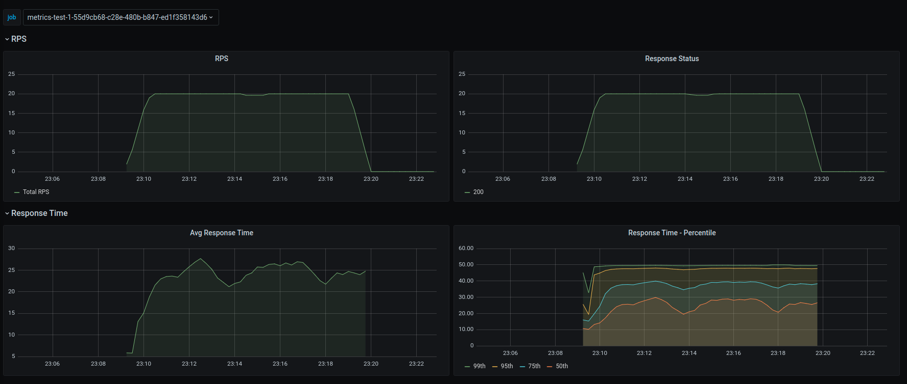
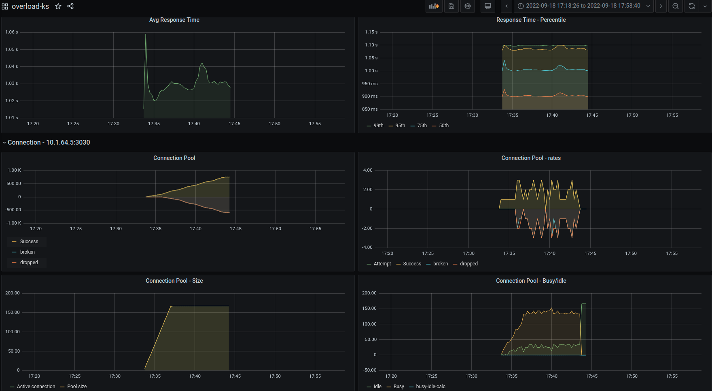

# Monitoring
The application comes with Prometheus support for monitoring. Metrics are exposed at `/metrics` endpoint.

Sample Prometheus scraper config
```yaml
- job_name: overload-k8s
  honor_timestamps: true
  scrape_interval: 5s
  scrape_timeout: 1s
  metrics_path: /metrics
  scheme: http
  kubernetes_sd_configs:
  - api_server: <k8s-api-server>
    role: endpoints
    namespaces:
      names:
      - default
    selectors:
    - role: endpoints
      field: metadata.name=overload
```

## Histogram
Check Prometheus [HISTOGRAMS AND SUMMARIES](https://prometheus.io/docs/practices/histograms/).

By default, the application uses (20, 50, 100, 300, 700, 1100) as buckets to calculate response
time quantiles. But each service has difference requirements, so the application provides a way to
configure buckets in the test request itself.

Test endpoint accepts an array field `histogramBuckets`. Users can use this field to configure
their own criteria. Currently, the field allows any number of buckets, but it's advisable not to
use more than six buckets.

## Grafana Dashboard
The application provides [sample Grafana dashboard](https://grafana.com/grafana/dashboards/17250-overload/) that can be used for monitoring. It has
graphs for Request Per Seconds, Response Status count, Average response time and Response time quantiles.



